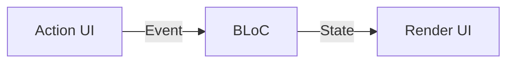
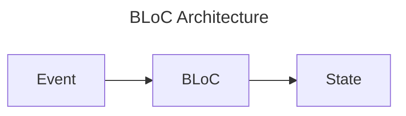

## BLoC方式思考

软件角度，单向数据流:



Bloc 角度



图论的角度

- state: 节点
- event: 边

## 实现过程

对于 Counter

1. 定义状态空间

    ```
    State = Int
    ```

2. 定义事件(Event)

    ```
    Event = Increment | Decrement
    ```

    即

    ```dart
    sealed class CounterEvent {
      const CounterEvent();
    }

    final class Increment extends CounterEvent {
      const Increment();
    }

    final class Decrement extends CounterEvent {
      const Decrement();
    }
    ```

3. 实现 BLoc

    ```
    Bloc
      | increment = state + 1
      | decrement = state - 1
    ```

    即

    ```dart
    class CounterBloc extends Bloc<CounterEvent, int> {
      CounterBloc() : super(0) {
        on<Increment>((event, emit) => emit(state + 1));
        on<Decrement>((event, emit) => emit(state - 1));
      }
    }
    ```

4. 实现 Action UI

    ```dart
    onPressed: () => context.read<CounterBloc>().add(Increment())
    onPressed: () => context.read<CounterBloc>().add(Decrement())
    ```

5. 实现 Render UI

    ```dart
    BlocBuilder<CounterBloc, int>(
      builder: (context, state) => Text('$state')
    )
    ```

## 测试

### 测试event/state

一般测试等价性

```
assert TimerInitial(60) == TimerInitial(60)
```

即

```dart
expect(
  TimerInitial(60),
  TimerInitial(60),
);
```

### 测试 bloc

测试的就是输入和输出

```
CounterBloc(increment) == [1]
```

即

```dart
blocTest<CounterBloc, int>(
  'CounterBloc emits [1] when increment is called',
  build: () => CounterBloc(),
  act: (bloc) => bloc.add(Increment()),
  expect: () => [1],
);
```

### 测试 render UI


